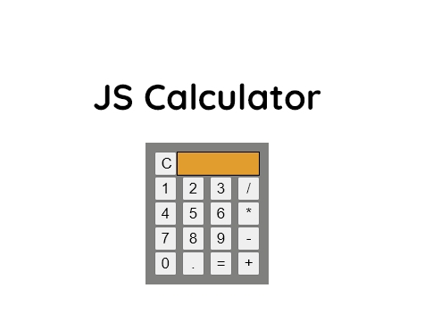

# This is Project Five for SDMM - JS Calculator App

### About

This is a basic calculator built using JavaScript, HTML & CSS.
No Frameworks used.

**Focus on simplicity and getting the app to work.**

Here is my working application:  [My Calculator App](https://erickarodom.github.io/JSCalculator/)

 ## Guidelines
 - 🕰 Completion time is 2 weeks.
 - 📚 No libraries or frameworks.
 - 
 -  Don't follow a tutorial or copy someone elses project code.

## Summary
This is a JS calculator. The user is able to perform simple arithmetic calculations and have the answer displayed.

These are the highlights of this project: 
- HTML, CSS scaffolding on this project is basic and quick.
- The JavaScript for this project required me to stretch my JS logic muscles, easily the best part of this project:
 - breaking down the functionality into digestible pieces.
 - while building the smaller pieces my understanding of functions, function scope, data type selection, and using loops was greatly enhanced!

[My Live Application](https://erickarodom.github.io/JSExpenseTrackerApp/)

## License
Distributed under the MIT License.

## Contact Developer
[![LinkedIn][linkedin-shield]][linkedin-url]   or  Email me: <a href="mailto:ericka.r.odom@gmail.com">📧</a>

[//]: # (Just testing writing comments?)

[linkedin-shield]: <https://img.shields.io/badge/-LinkedIn-black.svg?style=for-the-badge&logo=linkedin&colorB=555>
[linkedin-url]: https://linkedin.com/in/ericka-odom

  
   
 

